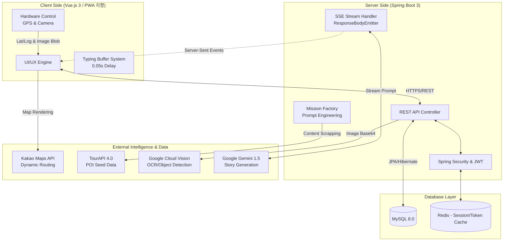
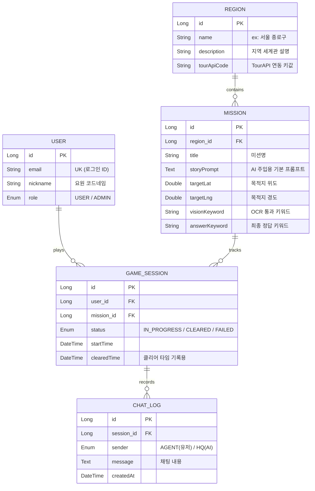

# 🕵️‍♂️ Operation: SEOUL (리얼월드 AI 방탈출 플랫폼)

> "도심 속 명소가 거대한 방탈출 무대가 된다."
> 한국관광공사 TourAPI와 Google AI(Vision, LLM)를 결합한 위치 기반(LBS) 게이미피케이션 관광 활성화 서비스입니다.

<br>

## 📌 1. 시스템 아키텍처 (System Architecture)

본 프로젝트는 실시간 데이터 처리와 외부 지능형 API 연동을 위한 비동기 스트리밍 구조를 채택하고 있습니다.



### 💡 아키텍처 상세 설명
* **Client Side**: Vue 3 Composition API를 활용해 상태(Pinia)를 관리합니다. 모바일 브라우저 환경에서 Geolocation API로 사용자 좌표를 추적하고, 프론트엔드 자체 타이핑 버퍼(Typing Buffer) 로직을 구현하여 네트워크 지연(Latency)에도 끊김 없는 AI 타자기 연출을 보장합니다.
* **Server Side**: Spring Boot 3를 기반으로 RESTful API를 제공합니다. 핵심인 SSE Stream Handler는 AI(Gemini)의 응답을 청크(Chunk) 단위로 쪼개어 클라이언트에 실시간으로 밀어내는(Push) 단방향 비동기 통신을 담당합니다.
* **External Integration**: TourAPI에서 수집한 명소(POI) 데이터를 Mission Factory 파이프라인에 통과시켜 Gemini 프롬프트로 주입, 매번 새로운 세계관의 미션 스토리를 자동 생성합니다.

<br>

## 🧩 2. 핵심 도메인 모델 (Core Domain Model)

서비스의 근간이 되는 RDB(MySQL) 설계입니다. 5대 핵심 엔티티 간의 관계를 통해 "유저가 특정 지역의 미션을 선택하여 세션을 생성하고, 채팅 기록을 남기는" 흐름을 정의합니다.



### 💡 도메인 상세 설명
* **Region과 Mission (1:N)**: 하나의 테마 지역 안에는 여러 개의 세부 스토리 미션이 존재합니다.
* **Mission과 GameSession (1:N)**: 미션 정보는 정적인 마스터 데이터이며, 유저가 미션을 시작할 때마다 고유한 GameSession 인스턴스가 생성되어 진행 상태(Status)를 추적합니다.
* **GameSession과 ChatLog (1:N)**: 특정 세션 내에서 발생한 AI와의 핑퐁 대화 내역을 타임스탬프와 함께 보관합니다.

<br>

## 🏗 3. 프로젝트 계층 구조 (Layer Structure)

단일 책임 원칙(SRP)과 관심사 분리(SoC)를 철저히 지키며, 기능 확장이 용이하도록 도메인형 디렉토리 구조를 채택했습니다.

```text
operation-seoul
├── backend (Spring Boot 3 - Java 17)
│   ├── src/main/java/com/operation/seoul
│   │   ├── global (공통 예외 처리, 보안, 설정) 
│   │   ├── game (게임 코어 & AI 스트리밍 도메인)
│   │   └── location (지도 & 미션 공장 도메인) 
│   └── build.gradle
└── frontend (Vue.js 3 - Vite)
    ├── src
    │   ├── api (Axios 인스턴스) 
    │   ├── assets (폰트, 이미지, 스타일시트)
    │   ├── components (ChatBubble, MapMarker, CameraScanner) 
    │   ├── composables (useGeolocation, useTypingBuffer) 
    │   ├── store (Pinia - sessionStore.js) 
    │   ├── views (MapView.vue, IntroView.vue) 
    │   └── router (vue-router 설정)
    └── vite.config.js
```

<br>

## 🛠 4. 기술 스택 (Tech Stack)

프론트엔드와 백엔드 모두 엔터프라이즈 환경에서 검증된 최신 기술 스택을 도입하여 안정성과 유지보수성을 극대화했습니다.

| 구분 | 기술 스택 | 도입 목적 (Why) |
| :--- | :--- | :--- |
| **Frontend** | Vue 3 (Composition API) | 로직 재사용성(composables) 극대화 및 반응형 UI 구축 |
| | Pinia | 가볍고 직관적인 전역 상태 관리 (유저 세션, 토큰 보관) |
| | Axios & Vue Router | REST API 비동기 통신 및 네비게이션 가드를 통한 라우팅 보안 |
| **Backend** | Java 17 & Spring Boot 3.x | 최신 문법 활용 및 안정적인 서버 아키텍처 |
| | Spring Data JPA | 객체 지향적 데이터 접근 및 유지보수 용이성 |
| | Spring Security & JWT | Stateless 기반의 안전한 REST API 인증/인가 체계 구축 |
| **Database** | MySQL 8.0 (Aiven - 개발, AWS RDS-배포)[예정] | 공간 데이터(Spatial Data) 확장성과 트랜잭션 무결성 보장 |
| **AI Engine** | Google Gemini 1.5 Flash (LLM) | 빠른 응답 속도(Latency)와 문맥 파악 능력을 통한 실시간 대화 연출 |
| | Google Cloud Vision (OCR) | 현장 구조물/텍스트를 판독하여 어뷰징을 방지하는 OCR 검증 |
| **Data & API**| 한국관광공사 TourAPI 4.0 | 공공데이터 기반 초기 지역/명소 데이터 시딩 |
| | Kakao Maps API | 한국 지형에 최적화된 지도 렌더링 및 동적 마커 표시 |

<br>

## 📱 5. 전체 앱 뷰(View) 흐름도

유저가 앱을 실행하여 미션을 클리어하기까지 겪게 되는 코어 사이클입니다.

### 1) 준비 단계 (작전 탐색 및 선택)
* **`IntroView`**: 시스템 접속 관문 (로그인/회원가입).
* **`HomeView`**: 요원 대시보드. 진행 중인 작전 이어하기 및 전체 달성률 확인.
* **`RegionSelectView`**: 작전 지역(테마) 선택 리스트.
* **`MissionSelectView`**: 세부 스토리 미션 선택. 작전 시작 시 DB에 새로운 `GameSession` 생성.

### 2) 게임 진행 단계 (코어 게임 사이클)
* **`BriefingView`**: 프롤로그. 임무 배경 스토리와 첫 목적지 힌트 하달.
* **`MapView`**: 실제 도심 지도를 보며 이동. 실시간 GPS 위치와 목적지 마커 표시.
* **`CameraScannerView`**: 현장 도착 후 특정 구조물을 비추어 OCR로 단서 획득.
* **`AiChatView`**: 획득한 단서로 본부 오퍼레이터(AI)와 채팅하며 정답 도출. 정답 시 다음 장소로 순환.

### 3) 결과 단계 (작전 종료)
* **`ClearView`**: 모든 미션 완수 시 엔딩 화면 및 클리어 타임 제공. 확인 시 `HomeView`로 복귀.

<br>

## 🔒 6. 기술적 해결 과제 (Key Highlights)

1. **[SSE 스트리밍]**: `ResponseBodyEmitter`를 활용하여 AI 텍스트 생성 완료 전부터 데이터를 전송, 체감 대기 시간을 혁신적으로 단축
2. **[타자기 버퍼]**: 프론트엔드 자체 버퍼 큐(Queue) 로직으로 네트워크 환경에 구애받지 않는 일관된 0.05초 타자기 연출 구현
3. **[하이브리드 인증 체계]**: 유저의 모바일 GPS 좌표(1차 검증)와 실시간 카메라 OCR 사진 인증(2차 검증)을 결합하여 위치 조작 어뷰징 원천 차단
4. **[Mission Factory 파이프라인]**: TourAPI의 건조한 장소 설명 데이터를 Gemini 프롬프트로 가공하여 흥미로운 추리 스토리를 가진 미션 데이터로 자동 변환

<br>

## 🤝 7. 업무 분담 및 프로젝트 로드맵

도메인 지식을 깊이 있게 파악하기 위해 프론트/백엔드를 나누지 않고, **기능 단위로 기획부터 배포까지 전담하는 수직적(Vertical Slice) 분담 원칙**을 채택했습니다.

### 🌿 Git 협업 수칙 (GitHub Flow)
* `main`: 상시 배포 가능한 안정적인 버전을 유지합니다.
* `feature/도메인명`: 개별 기능 개발 브랜치 (예: `feature/auth`, `feature/ai-streaming`).
* PR(Pull Request) 시 충돌 방지를 위해 각자 맡은 도메인 영역 코드를 우선적으로 리뷰 및 병합합니다.

---

### 📍 [Phase 1] 근시점: 기반 공사 및 사용자 인증 (DB/로그인)
- [ ] [팀원 A] MySQL 8.0 인스턴스 세팅 및 도메인(User, Region 등) JPA 엔티티 매핑
- [ ] [팀원 A] Spring Security + JWT 기반 인증 로직 및 User CRUD API 개발
- [ ] [팀원 B] Vue 3 + Pinia를 활용한 전역 유저 상태(Session Store) 관리 세팅 완료
- [ ] [팀원 B] Axios 인터셉터(토큰 자동 전송) 및 Vue Router 네비게이션 가드 적용
- [ ] [팀원 B] `IntroView` (로그인/회원가입 UI) 개발 및 라우팅 연동

### 📍 [Phase 2] 중기: 본격적인 도메인 기능 개발 (수직 분담)
**팀원 A (Location & Mission Domain 담당)**
- [ ] [BE] 한국관광공사 TourAPI 연동 및 Region/Mission 데이터 시딩 로직 개발
- [ ] [FE] Kakao Maps API 연동 및 `MapMarker`를 활용한 동적 지도 뷰어 구현
- [ ] [FE] HTML5 Geolocation API(`useGeolocation`)를 활용한 실시간 위치 추적 기능 개발

**팀원 B (AI & Game Core Domain 담당)**
- [ ] [BE] Google Gemini 1.5 연동 및 비동기 스트리밍(SSE) 서버 응답 로직 구축
- [ ] [BE] Google Cloud Vision API 연동 및 현장 이미지 판독(`VisionAiService`) 로직 작성
- [ ] [FE] SSE 데이터 수신 처리 및 프론트엔드 자체 타자기 버퍼(`useTypingBuffer`) 개발
- [ ] [FE] `CameraScanner` 컴포넌트 및 `AiChatView` UI/UX 최적화 구현

### 📍 [Phase 3] 후기: 기능 융합 및 트러블 슈팅
- [ ] [팀원 A] TourAPI 데이터를 Gemini로 가공하여 미션 스토리를 자동 양산하는 시스템 구축
- [ ] [팀원 B] 'GPS 좌표 도달 여부' + 'OCR 사진 인증' 하이브리드 검증 로직 완성
- [ ] [공통/팀원 B] 로그인 → 지역 선택 → 미션 시작(`GameSession` 생성) → 지도 이동 → 사진 인증 → 채팅 도출로 이어지는 전체 상태 머신 통합

### 📍 [Phase 4] 만료 시점: QA, 최적화 및 배포
- [ ] [공통] 실제 도심(야외 환경)에서 스마트폰 테스트 진행 (GPS 오차 및 OCR 인식률 점검)
- [ ] [팀원 A] DB 성능 최적화 (조회가 잦은 위경도 데이터 및 채팅 로그 대상 인덱싱 적용)
- [ ] [공통] 클라우드 인프라(AWS EC2, RDS 등)에 `main` 브랜치 최종 배포 및 런칭
