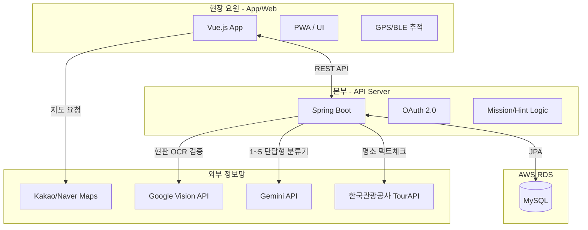
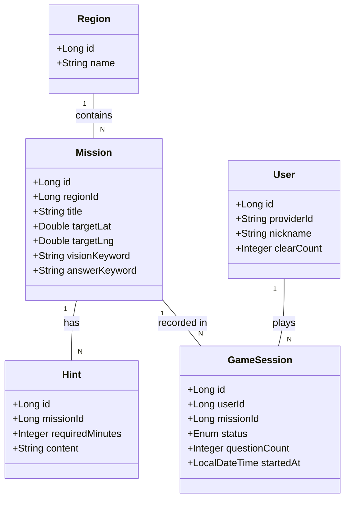

# 🕵️‍♂️ Operation: SEOUL (리얼월드 방탈출 AI 프로젝트)

> **"도심 속 명소가 거대한 방탈출 무대가 된다."** > 위치 기반(GPS) 인증과 Vision AI, LLM을 활용한 게이미피케이션 지역 관광 활성화 플랫폼입니다.

<br>

## 📌 1. 프로젝트 아키텍처 (System Architecture)

프론트엔드와 백엔드를 완전히 분리하고, 외부 AI/공공데이터 API를 적극 활용하는 제로 코스트(Zero-Cost) 프로토타입 아키텍처입니다.



<br>

## 📊 2. 핵심 도메인 모델 (Class Diagram)

향후 지자체 확장(B2G)을 고려한 다중 지역(Region) 기반의 DB 설계입니다. 모든 API 통신 변수명은 `camelCase`를 표준으로 합니다.



<br>

## 📂 3. 프로젝트 계층 구조 (Directory Structure)

본 프로젝트는 두 명의 백엔드 개발자가 도메인별 수직 분할(Vertical Slicing) 방식으로 협업하기 위해 Mono-repo 구조를 채택했습니다.

```text
Operation-Seoul/
├── frontend/ (Vue.js)
│   ├── src/
│   │   ├── api/          # 백엔드 호출 (Axios)
│   │   ├── components/   # UI 컴포넌트 (타이핑 애니메이션 등)
│   │   ├── views/        # 화면 (지도뷰, 카메라뷰, 채팅뷰)
│   │   └── store/        # 상태 관리 (세션, 유저 정보)
│
└── backend/ (Spring Boot)
    ├── src/main/java/com/operation/seoul/
    │   ├── controller/   # API 엔드포인트
    │   ├── service/      # 비즈니스 로직 및 외부 AI 연동
    │   ├── domain/       # JPA Entity 클래스
    │   ├── dto/          # 계층 간 데이터 교환 객체
    │   ├── repository/   # DB CRUD 로직
    │   └── util/         # GPS 검증 및 보안(Anti-Abuse) 모듈
```

<br>

## 🤝 4. 업무 분담 및 협업 규칙

* **[도메인 A] 지리 & 미션 데이터 (담당: 지리교육과 팀원)**
  * 프론트엔드: 지도 API 연동, 마커 렌더링, 위치 추적.
  * 백엔드: `Region`, `Mission` 도메인 CRUD, 한국관광공사 TourAPI 연동 및 데이터 파이프라인.
* **[도메인 B] 게임 코어 & AI (담당: 질문자님)**
  * 프론트엔드: 카메라 제어, 타이머 시스템, 바다거북 스프 채팅 UI.
  * 백엔드: `GameSession` 제어, Google Vision API(OCR) 검증, Gemini API 통신(1~5 단답형 분류기).

**Git 협업 수칙 (GitHub Flow)**
1. `main` 브랜치는 항상 실행 가능한 상태를 유지합니다.
2. 기능 개발 시 반드시 `feature/기능명` 브랜치를 생성하여 작업합니다.
3. 코드 병합은 상호 **Pull Request (PR) 및 코드 리뷰** 승인 후 진행합니다.

<br>

## 🛠 5. 기술 스택 (Tech Stack)

### 📱 Frontend
* **Framework:** Vue.js 3 (Composition API)
* **PWA:** Vite PWA Plugin (모바일 앱 환경 구축)
* **State Management:** Pinia (세션 및 유저 상태 관리)
* **HTTP Client:** Axios

### ⚙️ Backend
* **Language:** Java 17
* **Framework:** Spring Boot 3.x
* **ORM:** Spring Data JPA
* **Security:** Spring Security (OAuth 2.0 소셜 로그인)
* **Build Tool:** Gradle

### 🗄️ Database & Infrastructure
* **RDBMS:** MySQL
* **Cloud Hosting:** AWS EC2 (t2.micro - Free Tier)
* **Database Hosting:** AWS RDS (db.t3.micro - Free Tier)

### 🌐 External APIs (Open API & AI)
* **Vision AI:** Google Cloud Vision API (현판/안내판 OCR 텍스트 추출)
* **LLM (동적 추리):** Google Gemini API (1~5 단답형 분류기)
* **Map & LBS:** Kakao Maps API / Naver Maps API
* **Public Data:** 한국관광공사 TourAPI (명소 상세 정보 및 팩트체크용)

### 🤝 DevOps & Collaboration
* **Version Control:** Git
* **Repository & CI/CD:** GitHub (GitHub Flow 전략 사용)
* **Project Management:** GitHub Projects (Kanban Board), Issues, Pull Requests
* **API Docs & Testing:** Postman, Swagger (Springdoc OpenAPI)