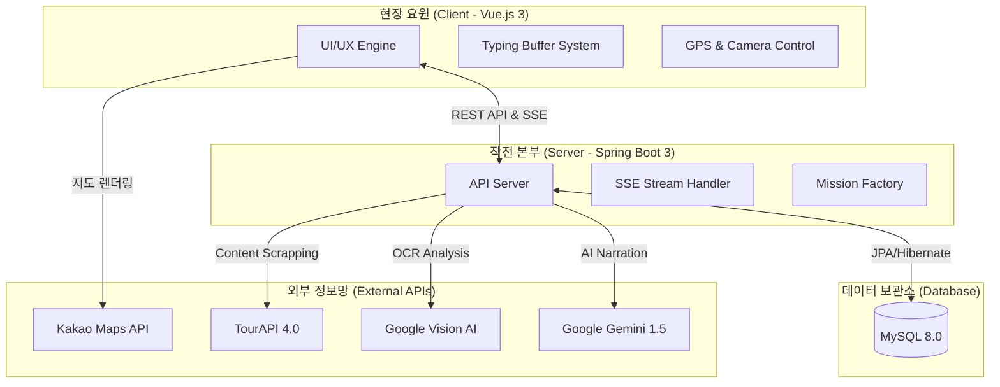
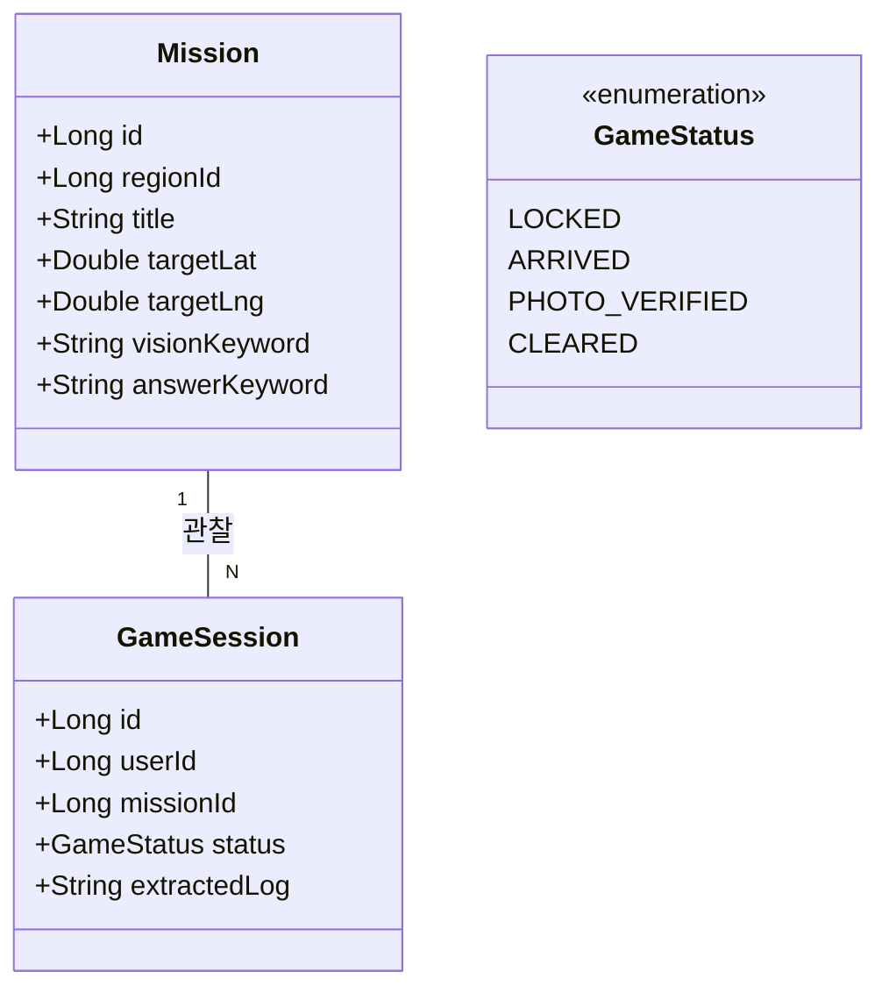
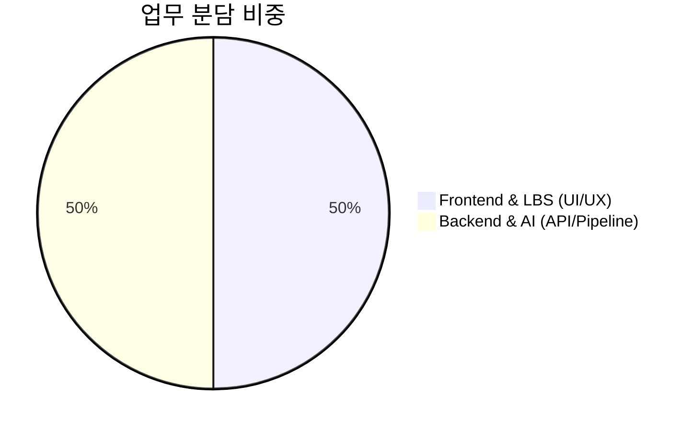

# 🕵️‍♂️ Operation: SEOUL (리얼월드 AI 방탈출 플랫폼)

> **"도심 속 명소가 거대한 방탈출 무대가 된다."**
> 한국관광공사 TourAPI와 Google AI(Vision, LLM)를 결합한 위치 기반(LBS) 게이미피케이션 관광 활성화 서비스입니다.

<br>

## 📌 1. 시스템 아키텍처 (System Architecture)

본 프로젝트는 실시간 데이터 처리와 외부 지능형 API 연동을 위한 **비동기 스트리밍 구조**를 채택하고 있습니다.



<br>

## 🧩 2. 핵심 도메인 모델 (Core Domain Model)

데이터 간의 관계와 게임 상태 관리 로직을 시각화한 클래스 구조입니다.



<br>

## 🏗 3. 프로젝트 계층 구조 (Layer Structure)

기능별로 분리된 클린 아키텍처 폴더 구조입니다.

```text
operation-seoul
├── backend (Spring Boot)
│   ├── src/main/java/com/operation/seoul
│   │   ├── game (게임 로직)
│   │   │   ├── controller (SSE/REST API)
│   │   │   ├── service (Vision/Gemini 연동)
│   │   │   └── domain (Session 관리)
│   │   └── location (위치 정보)
│   │       ├── controller (TourAPI 연동)
│   │       └── domain (Mission 관리)
│   └── build.gradle
└── frontend (Vue.js 3)
    ├── src
    │   ├── components (UI/UX)
    │   ├── views (MapView.vue - 핵심 화면)
    │   └── store (Pinia - 상태 관리)
    └── vite.config.js
```

<br>

## 🤝 4. 업무 분담 및 협업 규칙 (Collaboration)



### 🌿 Git 협업 수칙 (GitHub Flow)
- **main**: 상시 배포 가능한 안정적인 최신본 유지
- **feature/기능명**: 새로운 기능 개발 브랜치 (예: `feature/ai-streaming`)
- **Commit Convention**: 
  - `feat:` (기능), `fix:` (버그), `docs:` (문서), `refactor:` (개선)

<br>

## 🛠 5. 기술 스택 (Tech Stack)

| 구분 | 기술 스택 |
| :--- | :--- |
| **Frontend** | Vue 3, Pinia, Axios, Kakao Maps API |
| **Backend** | Java 17, Spring Boot 3.x, Spring Data JPA |
| **Database** | MySQL 8.0 |
| **AI Engine** | Gemini 1.5 Flash (LLM), Google Cloud Vision (OCR) |
| **Data** | 한국관광공사 TourAPI 4.0 |

<br>

## 🔒 6. 기술적 해결 과제 (Key Highlights)

1. **[SSE 스트리밍]**: `ResponseBodyEmitter`를 활용하여 AI 응답 대기 시간을 혁신적으로 단축
2. **[타자기 버퍼]**: 프론트엔드 자체 버퍼 로직으로 네트워크 끊김 없는 0.05초 타자기 연출 구현
3. **[하이브리드 인증]**: GPS 좌표와 실시간 OCR 사진 인증을 결합하여 어뷰징 원천 차단
4. **[Mission Factory]**: TourAPI 데이터를 기반으로 AI가 미션 스토리를 자동 생성하는 파이프라인 구축