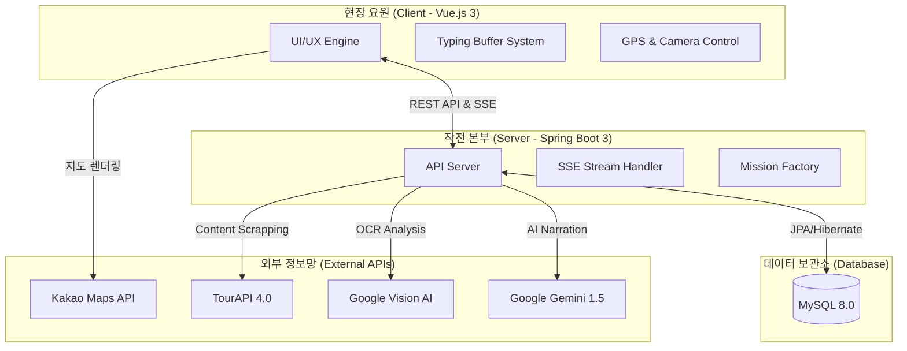
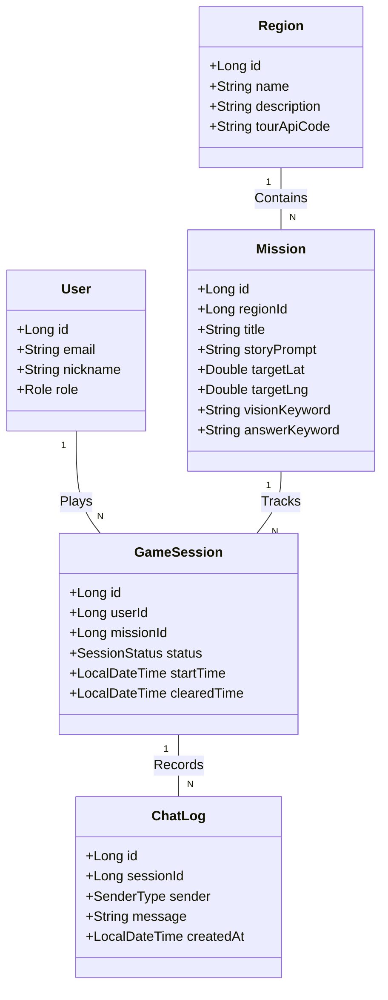

# 🕵️‍♂️ Operation: SEOUL (리얼월드 AI 방탈출 플랫폼)

> **"도심 속 명소가 거대한 방탈출 무대가 된다."**
> 한국관광공사 TourAPI와 Google AI(Vision, LLM)를 결합한 위치 기반(LBS) 게이미피케이션 관광 활성화 서비스입니다.

<br>

## 📌 1. 시스템 아키텍처 (System Architecture)

본 프로젝트는 실시간 데이터 처리와 외부 지능형 API 연동을 위한 **비동기 스트리밍 구조**를 채택하고 있습니다.



<br>

## 🧩 2. 핵심 도메인 모델 (Core Domain Model)

실제 RDB 테이블 설계 및 비즈니스 로직의 근간이 되는 상세 엔티티 연관관계입니다. 유저, 지역(테마), 미션, 그리고 게임 세션과 채팅 로그가 유기적으로 맞물려 작동합니다.



<br>

## 🏗 3. 프로젝트 계층 구조 (Layer Structure)

단일 책임 원칙(SRP)과 관심사 분리(SoC)를 철저히 지킨 실무형 디렉토리 구조입니다.

```text
operation-seoul
├── backend (Spring Boot)
│   ├── src/main/java/com/operation/seoul
│   │   ├── global (공통 예외 처리, 보안, 설정)
│   │   │   ├── config (SecurityConfig, WebMvcConfig)
│   │   │   └── exception (GlobalExceptionHandler)
│   │   ├── game (게임 코어 & AI 스트리밍 도메인)
│   │   │   ├── controller (GameSessionController)
│   │   │   ├── service (VisionAiService, GeminiAiService)
│   │   │   ├── domain (GameSession, ChatLog)
│   │   │   └── dto (SessionRequest, ChatResponse)
│   │   └── location (지도 & 미션 공장 도메인)
│   │       ├── controller (MissionController)
│   │       ├── service (TourApiService, MissionFactory)
│   │       └── domain (Region, Mission)
│   └── build.gradle
└── frontend (Vue.js 3)
    ├── src
    │   ├── api (Axios 인스턴스, Fetch API 캡슐화)
    │   ├── assets (폰트, 이미지, 스타일시트)
    │   ├── components (ChatBubble, MapMarker, CameraScanner)
    │   ├── composables (useGeolocation, useTypingBuffer)
    │   ├── store (Pinia - useSessionStore)
    │   ├── views (MapView.vue, IntroView.vue)
    │   └── router (vue-router 설정)
    └── vite.config.js
```

<br>

## 🤝 4. 업무 분담 및 협업 규칙 (Collaboration)

프론트엔드/백엔드라는 단순 계층적(Horizontal) 분할을 지양하고, **기능 및 도메인 단위로 프론트부터 백엔드까지 완전히 책임지는 수직적(Vertical Slice) 업무 분담**을 채택하여 개발 속도와 오너십을 극대화했습니다.

* **팀원 A (Location & Mission Domain 담당):**
  * [Backend] TourAPI 연동 및 데이터 파이프라인(Mission Factory) 구축, Region/Mission CRUD API 개발.
  * [Frontend] Kakao Maps API 연동, 동적 마커 렌더링, HTML5 Geolocation 기반 실시간 GPS 위치 추적 UI 구현.
* **팀원 B (AI & Game Core Domain 담당):**
  * [Backend] Google Vision API(OCR) 이미지 판독, Gemini 1.5 비동기 스트리밍(SSE) 서버 구축, GameSession 상태 머신 제어.
  * [Frontend] 카메라 스캐너 연동, SSE 데이터 수신 및 자체 타이핑 버퍼(Typing Buffer) 시스템 구현, 채팅 UI/UX 최적화.

### 🌿 Git 협업 수칙 (GitHub Flow)
- **main**: 상시 배포 가능한 안정적인 최신본 유지
- **feature/도메인명**: 새로운 기능 개발 브랜치 (예: `feature/ai-streaming`, `feature/map-render`)
- PR(Pull Request) 시 충돌 방지를 위해 각자 맡은 도메인 영역 코드를 우선적으로 리뷰 및 병합(Merge)합니다.

<br>

## 🛠 5. 기술 스택 (Tech Stack)

| 구분 | 기술 스택 |
| :--- | :--- |
| **Frontend** | Vue 3 (Composition API), Pinia, Axios, Kakao Maps API |
| **Backend** | Java 17, Spring Boot 3.x, Spring Data JPA, Spring Security |
| **Database** | MySQL 8.0, AWS RDS |
| **AI Engine** | Gemini 1.5 Flash (LLM), Google Cloud Vision (OCR) |
| **Data** | 한국관광공사 TourAPI 4.0 |

<br>

## 🔒 6. 기술적 해결 과제 (Key Highlights)

1. **[SSE 스트리밍]**: `ResponseBodyEmitter`를 활용하여 AI 응답 대기 시간을 혁신적으로 단축
2. **[타자기 버퍼]**: 프론트엔드 자체 버퍼 로직으로 네트워크 끊김 없는 0.05초 타자기 연출 구현
3. **[하이브리드 인증]**: GPS 좌표와 실시간 OCR 사진 인증을 결합하여 어뷰징 원천 차단
4. **[Mission Factory]**: TourAPI 데이터를 기반으로 AI가 미션 스토리를 자동 생성하는 파이프라인 구축